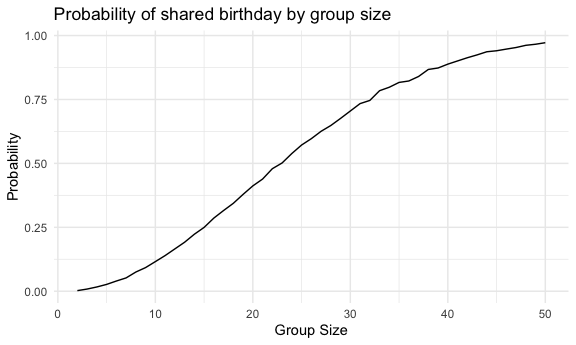

p8105_hw5_hc3448
================
HsiYu Chen
2024-11-13

### Problem 1

``` r
bday_sim  = function(n){
  bday = sample (1:365, size = n, replace = TRUE)
  duplicate = length(unique(bday)) <n
  return(duplicate)
}
```

``` r
sim_res = 
  expand_grid(
    n = 2:50,
    iter = 1:10000
  ) |>
  mutate(res = map_lgl(n, bday_sim)) |>
  group_by(n) |>
  summarize(prob = mean(res))
```

``` r
sim_res |>
  ggplot(aes(x=n, y=prob)) +
  geom_line() +
  labs(
    x = "Sample Size",           
    y = "Probability",        
    title = "Probability of shared birthday by group size" 
  )
```



When the group size increases, the probability that at least two people
in the group will share a birthday also increases. When there’s around
25 people in the group, there is higher than 50% of the probability that
there are at least two people sharing a birthday.

### Problem 2

### Problem 3
