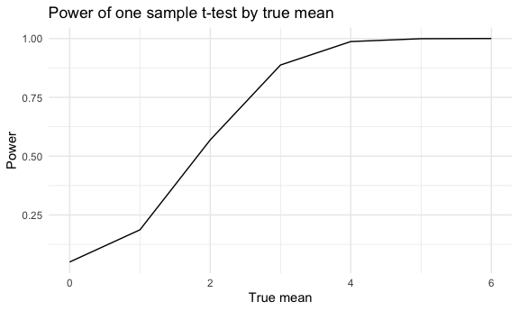
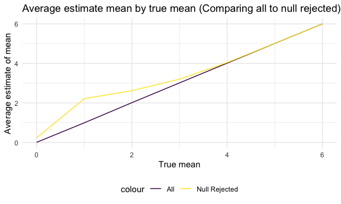
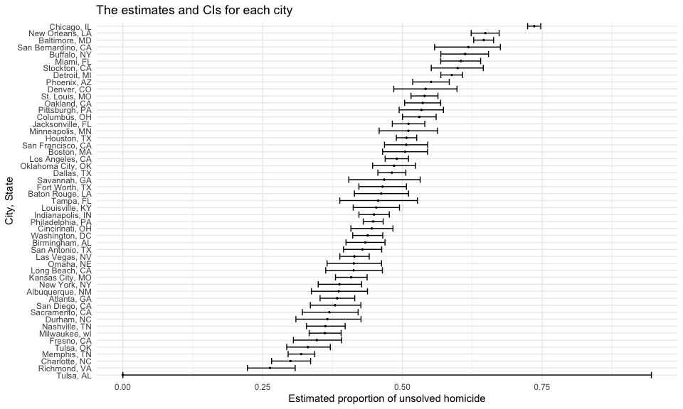

p8105_hw5_hc3448
================
HsiYu Chen
2024-11-13

### Problem 1

``` r
bday_sim  = function(n){
  bday = sample (1:365, size = n, replace = TRUE)
  duplicate = length(unique(bday)) <n
  return(duplicate)
}
```

``` r
sim_res = 
  expand_grid(
    n = 2:50,
    iter = 1:10000
  ) |>
  mutate(res = map_lgl(n, bday_sim)) |>
  group_by(n) |>
  summarize(prob = mean(res))
```

``` r
sim_res |>
  ggplot(aes(x=n, y=prob)) +
  geom_line() +
  labs(
    x = "Group Size",           
    y = "Probability",        
    title = "Probability of shared birthday by group size" 
  )
```


When the group size increases, the probability that at least two people
in the group will share a birthday also increases. When there’s around
25 people in the group, there is higher than 50% of the probability that
there are at least two people sharing a birthday.

### Problem 2

``` r
n = 30
sigma = 5
mu_list = 0:6
alpha = 0.05
n_dataset = 5000
```

``` r
sim_t_test = function(mu){
  x = rnorm(n, mean = mu, sd = sigma)
  test_result = broom::tidy(t.test(x, mu = 0))
  tibble(
    estimate = test_result[["estimate"]],
    p_value = test_result[["p.value"]]
  )
}

sim_result = 
  expand_grid(
    mu = mu_list,
    iteration = 1: n_dataset
  ) |>
  mutate(
    result_df = map(mu, sim_t_test)
  ) |>
  unnest(result_df)

power_result = 
  sim_result |>
  group_by(mu) |>
  summarize(power = mean(p_value < alpha))
```

``` r
power_result |>
  ggplot(aes(x = mu, y = power)) +
  geom_line() +
  labs(
    x = "True mean",           
    y = "Power",        
    title = "Power of one sample t-test by true mean" 
  ) 
```



The graph shows that the power of the test increases when the true means
increases. It suggests that a higher the probability of rejecting the
null hypothesis when the effect size is larger.

``` r
estimate_result =
  sim_result |>
  group_by(mu) |>
  summarize(
    avg_estimate = mean(estimate),
    avg_estimate_rej = mean(estimate[p_value < alpha], na.rm = TRUE)
  )
```

``` r
estimate_result |>
  ggplot(aes(x = mu)) +
  geom_line(aes(y = avg_estimate, color = "All")) +
  geom_line(aes(y = avg_estimate_rej, color = "Null Rejected")) +
  labs(
    x = "True mean",           
    y = "Average estimate of mean",        
    title = "Average estimate mean by true mean (Comparing all to null rejected)" 
  )
```



The graph shows that the average estimate of μ for rejected tests is
generally higher than the true value, particularly for smaller effect
sizes. This inflation occurs because only larger estimates are likely to
exceed the significance threshold of α = 0.05, thus skewing the average
upward in cases where the null hypothesis is rejected

### Problem 3

``` r
homicide_df = read.csv("data/homicide-data.csv")
```

The raw data contains 52179 criminal homicides in 50 large U.S. cities
and the variables includes the reported date, disposition, city,
victims’ name, sex, race, and age.

``` r
homicide_sum = 
  homicide_df |>
  mutate(city_state = paste(city, state, sep = ", ")) |>
  group_by(city_state) |>
  summarize(
    total_number_homicides = n(),
    number_unsolved_homicides = sum(disposition %in% c("Closed without arrest", "Open/No arrest"),
                                    na.rm = TRUE)
  ) 
homicide_sum |> knitr::kable()
```

| city_state         | total_number_homicides | number_unsolved_homicides |
|:-------------------|-----------------------:|--------------------------:|
| Albuquerque, NM    |                    378 |                       146 |
| Atlanta, GA        |                    973 |                       373 |
| Baltimore, MD      |                   2827 |                      1825 |
| Baton Rouge, LA    |                    424 |                       196 |
| Birmingham, AL     |                    800 |                       347 |
| Boston, MA         |                    614 |                       310 |
| Buffalo, NY        |                    521 |                       319 |
| Charlotte, NC      |                    687 |                       206 |
| Chicago, IL        |                   5535 |                      4073 |
| Cincinnati, OH     |                    694 |                       309 |
| Columbus, OH       |                   1084 |                       575 |
| Dallas, TX         |                   1567 |                       754 |
| Denver, CO         |                    312 |                       169 |
| Detroit, MI        |                   2519 |                      1482 |
| Durham, NC         |                    276 |                       101 |
| Fort Worth, TX     |                    549 |                       255 |
| Fresno, CA         |                    487 |                       169 |
| Houston, TX        |                   2942 |                      1493 |
| Indianapolis, IN   |                   1322 |                       594 |
| Jacksonville, FL   |                   1168 |                       597 |
| Kansas City, MO    |                   1190 |                       486 |
| Las Vegas, NV      |                   1381 |                       572 |
| Long Beach, CA     |                    378 |                       156 |
| Los Angeles, CA    |                   2257 |                      1106 |
| Louisville, KY     |                    576 |                       261 |
| Memphis, TN        |                   1514 |                       483 |
| Miami, FL          |                    744 |                       450 |
| Milwaukee, wI      |                   1115 |                       403 |
| Minneapolis, MN    |                    366 |                       187 |
| Nashville, TN      |                    767 |                       278 |
| New Orleans, LA    |                   1434 |                       930 |
| New York, NY       |                    627 |                       243 |
| Oakland, CA        |                    947 |                       508 |
| Oklahoma City, OK  |                    672 |                       326 |
| Omaha, NE          |                    409 |                       169 |
| Philadelphia, PA   |                   3037 |                      1360 |
| Phoenix, AZ        |                    914 |                       504 |
| Pittsburgh, PA     |                    631 |                       337 |
| Richmond, VA       |                    429 |                       113 |
| Sacramento, CA     |                    376 |                       139 |
| San Antonio, TX    |                    833 |                       357 |
| San Bernardino, CA |                    275 |                       170 |
| San Diego, CA      |                    461 |                       175 |
| San Francisco, CA  |                    663 |                       336 |
| Savannah, GA       |                    246 |                       115 |
| St. Louis, MO      |                   1677 |                       905 |
| Stockton, CA       |                    444 |                       266 |
| Tampa, FL          |                    208 |                        95 |
| Tulsa, AL          |                      1 |                         0 |
| Tulsa, OK          |                    583 |                       193 |
| Washington, DC     |                   1345 |                       589 |

``` r
baltimore_df = 
  homicide_sum |>
  filter(city_state == "Baltimore, MD")
  
baltimore_test = 
  prop.test(
    baltimore_df[['number_unsolved_homicides']],
    baltimore_df[['total_number_homicides']]
  ) |> 
  broom::tidy()

baltimore_result <- baltimore_test |> 
  select(estimate, conf.low, conf.high)

baltimore_result |> knitr::kable()
```

|  estimate |  conf.low | conf.high |
|----------:|----------:|----------:|
| 0.6455607 | 0.6275625 | 0.6631599 |

``` r
unsolved_func = function(unsolved, total){
  test_result = prop.test(unsolved, total)
  broom::tidy(test_result) |>
    select(estimate, conf.low, conf.high)
}

all_city_unsolved =
  homicide_sum |>
  mutate(
    test_result = purrr::map2(number_unsolved_homicides, total_number_homicides, \(x,y) unsolved_func(x,y))
  )|>
  unnest(test_result)

all_city_unsolved |> knitr::kable(digit = 3)
```

| city_state | total_number_homicides | number_unsolved_homicides | estimate | conf.low | conf.high |
|:---|---:|---:|---:|---:|---:|
| Albuquerque, NM | 378 | 146 | 0.386 | 0.337 | 0.438 |
| Atlanta, GA | 973 | 373 | 0.383 | 0.353 | 0.415 |
| Baltimore, MD | 2827 | 1825 | 0.646 | 0.628 | 0.663 |
| Baton Rouge, LA | 424 | 196 | 0.462 | 0.414 | 0.511 |
| Birmingham, AL | 800 | 347 | 0.434 | 0.399 | 0.469 |
| Boston, MA | 614 | 310 | 0.505 | 0.465 | 0.545 |
| Buffalo, NY | 521 | 319 | 0.612 | 0.569 | 0.654 |
| Charlotte, NC | 687 | 206 | 0.300 | 0.266 | 0.336 |
| Chicago, IL | 5535 | 4073 | 0.736 | 0.724 | 0.747 |
| Cincinnati, OH | 694 | 309 | 0.445 | 0.408 | 0.483 |
| Columbus, OH | 1084 | 575 | 0.530 | 0.500 | 0.560 |
| Dallas, TX | 1567 | 754 | 0.481 | 0.456 | 0.506 |
| Denver, CO | 312 | 169 | 0.542 | 0.485 | 0.598 |
| Detroit, MI | 2519 | 1482 | 0.588 | 0.569 | 0.608 |
| Durham, NC | 276 | 101 | 0.366 | 0.310 | 0.426 |
| Fort Worth, TX | 549 | 255 | 0.464 | 0.422 | 0.507 |
| Fresno, CA | 487 | 169 | 0.347 | 0.305 | 0.391 |
| Houston, TX | 2942 | 1493 | 0.507 | 0.489 | 0.526 |
| Indianapolis, IN | 1322 | 594 | 0.449 | 0.422 | 0.477 |
| Jacksonville, FL | 1168 | 597 | 0.511 | 0.482 | 0.540 |
| Kansas City, MO | 1190 | 486 | 0.408 | 0.380 | 0.437 |
| Las Vegas, NV | 1381 | 572 | 0.414 | 0.388 | 0.441 |
| Long Beach, CA | 378 | 156 | 0.413 | 0.363 | 0.464 |
| Los Angeles, CA | 2257 | 1106 | 0.490 | 0.469 | 0.511 |
| Louisville, KY | 576 | 261 | 0.453 | 0.412 | 0.495 |
| Memphis, TN | 1514 | 483 | 0.319 | 0.296 | 0.343 |
| Miami, FL | 744 | 450 | 0.605 | 0.569 | 0.640 |
| Milwaukee, wI | 1115 | 403 | 0.361 | 0.333 | 0.391 |
| Minneapolis, MN | 366 | 187 | 0.511 | 0.459 | 0.563 |
| Nashville, TN | 767 | 278 | 0.362 | 0.329 | 0.398 |
| New Orleans, LA | 1434 | 930 | 0.649 | 0.623 | 0.673 |
| New York, NY | 627 | 243 | 0.388 | 0.349 | 0.427 |
| Oakland, CA | 947 | 508 | 0.536 | 0.504 | 0.569 |
| Oklahoma City, OK | 672 | 326 | 0.485 | 0.447 | 0.524 |
| Omaha, NE | 409 | 169 | 0.413 | 0.365 | 0.463 |
| Philadelphia, PA | 3037 | 1360 | 0.448 | 0.430 | 0.466 |
| Phoenix, AZ | 914 | 504 | 0.551 | 0.518 | 0.584 |
| Pittsburgh, PA | 631 | 337 | 0.534 | 0.494 | 0.573 |
| Richmond, VA | 429 | 113 | 0.263 | 0.223 | 0.308 |
| Sacramento, CA | 376 | 139 | 0.370 | 0.321 | 0.421 |
| San Antonio, TX | 833 | 357 | 0.429 | 0.395 | 0.463 |
| San Bernardino, CA | 275 | 170 | 0.618 | 0.558 | 0.675 |
| San Diego, CA | 461 | 175 | 0.380 | 0.335 | 0.426 |
| San Francisco, CA | 663 | 336 | 0.507 | 0.468 | 0.545 |
| Savannah, GA | 246 | 115 | 0.467 | 0.404 | 0.532 |
| St. Louis, MO | 1677 | 905 | 0.540 | 0.515 | 0.564 |
| Stockton, CA | 444 | 266 | 0.599 | 0.552 | 0.645 |
| Tampa, FL | 208 | 95 | 0.457 | 0.388 | 0.527 |
| Tulsa, AL | 1 | 0 | 0.000 | 0.000 | 0.945 |
| Tulsa, OK | 583 | 193 | 0.331 | 0.293 | 0.371 |
| Washington, DC | 1345 | 589 | 0.438 | 0.411 | 0.465 |

``` r
all_city_unsolved |>
  ggplot(aes(y = reorder(city_state, estimate), x = estimate)) +
  geom_point(size = 0.5) +
  geom_errorbar(aes(xmin = conf.low, xmax = conf.high)) +
  labs(
    x = "Estimated proportion of unsolved homicide",
    y = "City, State",
    title = "The estimates and CIs for each city"
  ) 
```


